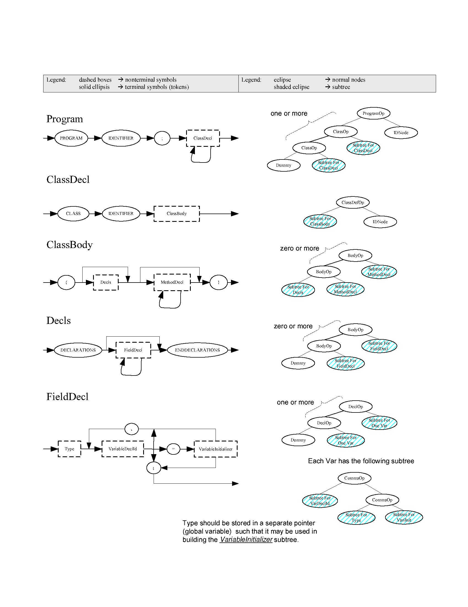

- [Project 1: Lexical Analysis](#project-1--lexical-analysis)
  * [Description](#description)
  * [Codespace Development Environment](#codespace-development-environment)
  * [Directory Structure and Makefile Script](#directory-structure-and-makefile-script)
  * [Implementation](#implementation)
    + [Token Definitions in MINI-JAVA](#token-definitions-in-mini-java)
    + [Completing lex.l](#completing-lexl)
    + [Completing table.cpp](#completing-tablecpp)
    + [Debugging](#debugging)
  * [Grading](#grading)
  * [Submission](#submission)

# Project 2: Syntax Analysis

DUE: November 7 (Thursday), 2024 Before Class

Please accept Project 2 on **GitHub Classroom** using the following link: TBD

The GitHub Classroom repository works the same way as your Project 1 repository.

## Description

In this phase of the project, you will write a syntax analyzer for the CS 1622
programming language, MINI-JAVA. The analyzer will consist of a parser, written
in Yacc, and routines to manage a string table, written in C/C++. The next
phase of the compiler project, semantic analysis, will traverse the parse tree
generated by syntax analysis and annotate tree nodes with semantic information
such as type information.  Please refer to the [Yacc (Yet Another
Compiler-Compiler)
tutorial](https://github.com/wonsunahn/CS1622_Fall2024/blob/main/resources/yacc.pdf)
in the course repository for reference.

## Codespace Development Environment

Please refer to the Project 1 CodeSpace Development Environment section to set
up the same development environment.

Once you install flex, you should be able to build the parser binary by invoking
the build target of the Makefile script on the terminal:

```
make build
```

This should result in the following output:

```
$ make build
flex lex.l 
yacc -d -v  grammar.y 
gcc -g -c y.tab.c
gcc -g -c proj2.c
g++ -g -c table.cpp
gcc -g -c driver.c
gcc -g -o parser y.tab.o proj2.o table.o driver.o -ll -lstdc++
```

After creating the parser binary, you are able to use the Debugger menu to step
through the code, put breakpoints, just like for Project 1.  Refer to the
[Debugging] section for more details.

## Directory Structure and Makefile Script

Here is an overview of the directory structure in alphabetical order.  The files that you are expected to modify are marked in bold:

* driver.c : The test driver for the parser that contains the main function.
* **grammar.y** : Implements the parser using the Yacc language.  **Modify**.
* **lex.l** : Implements the lexer using the Lex language.  **Modify**.
* Makefile: The build script for the make tool.
* proj2.c / proj2.h: Helper functions for the parser, pre-implemented for you.
* **table.cpp** : Implements the string table.  **Modify**.
* diffs_default/ : Directory where comparisons between outputs/ and outputs_solution/ are stored, generated by the <tt>diff</tt> command.
* diffs_side_by_side/ : Directory where side-by-side comparisons between outputs/ and outputs_solution/ are stored, generated by the <tt>diff</tt> command with the <tt>-y</tt> option added.
* outputs/ : Directory where outputs after running your parser on source files under tests/ are stored.
* outputs_solution/ : Directory where solution outputs after running the reference parser on source files under tests/ are stored.
* tests/ : Source files for testing and grading your parser.

As mentioned above, in order to just build the parser binary, you only need to invoke the build make target:

```
make build
```

To run the parser against the source files under tests/ after building, invoke the default make target:

```
make
```

The make script generates outputs and diffs in exactly the same way as in
Project 1.  If you wish to remove all files generated from the make script and
start from scratch, invoke the 'clean' target:

```
make clean
```

## Implementation

Your goal is to modify lex.l, table.cpp, and grammar.y so that your outputs are
identical to the solution outputs.  If you achieve that, the make build script
will show no errors when invoked, and all the .diff files under diffs_default/
will be empty when listed, just like for Project 1.  You will achieve this by
replacing the TODO comments in the source files as instructed in the comments.

You will complete lex.l and table.cpp mostly by reusing code that you wrote for
Project 1.  The bulk of your effort with be in completing grammar.y which
implements the parser using Yacc.  Yacc generates two C files from grammar.y,
y.tab.h and y.tab.c, that implements the parser.

### Completing lex.l

You can reuse the lex.l code that you submitted for Project 1, with a few
exceptions which I will explain here.  The difference at a high level is that
now the lexer is not operating standalone --- it is operating as part of the
parser.  In fact, you can see that lex.yy.c, which is the C file generated from
lex.l, is literally included at the bottom of the grammar.y parser
implementation file using the statement:

```
#include "lex.yy.c"
```

As such, you need to make a few changes to integrate the lexer into the parser.

1. Remove the #include of "token.h" from lex.l.

   You can see that all the tokens in the language is already defined in
grammar.y using the %token keyword.  When grammar.y is compiled into y.tab.h
and y.tab.c by the Yacc tool, all those tokens are defined in the y.tab.h file.
Hence, token.h is now redundant and is removed from the project. 

1. Remove the definition "int yycolumn, yyline, yylval;" from lex.l.

   You can see that yycolumn and yyline are already defined in grammar.y for
use inside the parse, so you should not redefine it in lex.l.  As to yylval, it
is not explicitly defined in grammar.y, but it is defined in the y.tab.c file
generated by Yacc from grammar.y.  Yylval is used in the parser in exactly the
same way we used it for Project 1: to store the lexeme values of tokens.

1. Change all references to "yylval" to "yylval.intg" in lex.l.

   Yylval is defined as YYSTYPE in y.tab.c.  YYSTYPE is the type that Yacc uses
to store and pass **semantic values** (also known as **attributes** in the
lecture slides) produced by **semantic actions** performed when grammar
production rules are applied.  As we learned, there is an attribute attached to
each symbol in the grammar, including terminals (tokens) and non-terminals.
The \$\$, \$1, \$2, and \$3 Yacc pseudo-variables used to refer to these
attribute values are all of type YYSTYPE.  YYSTYPE by default is defined as the
int type within Yacc.  Now, the int type may work to store semantic values for
terminals, also known as token lexemes, but it does not work well to store
semantic values for non-terminals.  The attributes for non-terminals are
typically pointers to a parse tree that represents that non-terminal.

   The %union keyword is used to redefine YYSTYPE as a union in grammar.y using the following lines:

   ```
   %union {
     int intg;
     tree tptr;
   }
   ```

   Now YYSTYPE is a C union type that is able to store either an int type or a
tree type in the same memory space.  Accessing yylval.intg will treat yylval as
an int type and accessing yylval.tptr will treat yylval as a tree type.  Here
is a [brief Wikipedia description of C union
types](https://en.wikipedia.org/wiki/C_data_types#Unions), if you need a
refresher.  Since all our lexemes are of int type, we want to store the lexeme
to yylval.intg in our lexer.

### Completing table.cpp

Again, you can reuse all the table.cpp code you wrote for Project 1.  Here are
the additional things needed.

1. Remove #include "token.h" and add #include "proj2.h", #include "y.tab.h".

   Again, token.h is now redundant.  All the tokens are defined in y.tab.h.

1. Change all references to "yylval" to "yylval.intg"

   This is for reasons identical to why we did this for lex.l, explained previously.

1. Write the additional function char* getString(int index).

   This function is used in the printtree() function in proj2.c to print
strings from the string table that corresponds to identifier and string
constant integer lexemes.

### Completing grammar.y

If you have completed both lex.l and table.cpp and you are this stage, please
try doing "make" again to regenerate the parser output files.  Then open
"outputs/err0.out".  If all went well, you should see the following content:

```
************* SYNTAX TREE PRINTOUT ***********

  +-[IDNode,0,"err0"]
R-[ProgramOp]
  +-[DUMMYnode]
```

## Appendix

### Appendix A: Helper functions in proj2.c

* tree NullExp();

  Returns a null node with kind=DummyNode and semantic value=0.

* tree MakeLeaf(int Kind, int N);

  Returns a leaf node of specified Kind with integer semantic value N.

* tree MakeTree(int NodeOp, tree Left, tree Right);

  Returns an internal node, T, such that NodeOp(T)=Op; LeftChild(T)=Left; RightChild(T)=Right and NodeKind(T)=InteriorNode.

* int NodeOp(tree T);

  See MakeTree. Returns the integer constant representing NodeOpType of T if T is an interior node, else returns 0 (undefined op).  Uses NodeKind(T) to distinguish leaf from interior.

* int NodeKind(tree T);

  Returns the kind of node T.

* tree LeftChild(tree T);

  Returns pointer to left child of T. Returns pointer to null node if NodeKind(T) != InteriorNode.

* tree RightChild(tree T);

  Returns pointer to right child of T. Returns pointer to null node if NodeKind(T) != InteriorNode.

* int IntVal(tree T);

  See MakeLeaf. Returns integer semantic value of node T if NodeKind(T) == IDNode, STRGNode, NUMNode, or BOOLNode. Otherwise returns -1 (undefined).

* int IsNull(tree T); 

  IsNull(T) iff T is null node.

* void SetNodeOp(tree T, int Op)

  NodeKind(T) must be InteriorNode. Makes NodeOp(T) = Op.

* void SetNodeKind(tree T, int Kind)

  NodeKind(T) must not be InteriorNode. Makes NodeKind(T) = Kind.

* void SetNodeVal(tree T, int Val)

  NodeKind(T) must not be InteriorNode. Makes IntVal(T) = Val.

* void SetLeftChild(tree T, tree NewChild)

  NodeKind(T) must be InteriorNode. Makes LeftChild(T) = NewChild.

* void SetRightChild(tree T, tree NewChild)

  NodeKind(T) must be InteriorNode. Makes RightChild(T) = NewChild.

### Appendix B: MINI-JAVA grammar specification

You can download the below grammar in [PDF format](imgs/"proj2.appendixB.pdf), if you prefer.




## Debugging

You can click on the Debugger menu on the VSCode IDE to get to the RUN AND
DEBUG pane.  There you will see a play icon next to a drop box with <tt>Launch parser</tt>
selected.  You can click on that play icon to start debugging.  The
<tt>Launch parser</tt> selection is a launch configuration defined in the
[.vscode/launch.json](.vscode/launch.json) file.  In that file, you will see
that the <tt>args</tt> property is set with an input redirection to
<tt>${workspaceFolder}/tests/helloworld.mjava</tt>.  If you wish to debug with some
other input file, please change helloworld.mjava to some other .mjava file
under the tests/ folder.

If you are not familiar with VSCode debugging, here is a tutorial:
https://code.visualstudio.com/docs/editor/debugging

Note that you are not allowed to put breakpoints on lex.l, because it is not a
C/C++ source file.  However, you can put breakpoints on lex.yy.c that is
generated from lex.l.

## Grading

Each of the 12 tests under the tests/ folder is worth 10 points for a total of
120 points.  A diff failure on the output for one of these .mjava files will
result in a deduction of 10 points.

## Submission

When all tests pass, you are ready to submit.  Please submit your GitHub
Classroom repository to GradeScope at the "Project 2" link.  Once you submit,
GradeScope will run the autograder to grade you and give feedback.  If you get
deductions, fix your code based on the feedback and resubmit.  Repeat until you
don't get deductions.  The tests performed on GradeScope is identical to the
tests under the tests/ folder.

Don't forget that you have to Commit and Push your changes to upload them to
the repository.  Please review this tutorial if you don't remember how:

https://docs.github.com/en/codespaces/developing-in-a-codespace/using-source-control-in-your-codespace#committing-your-changes
